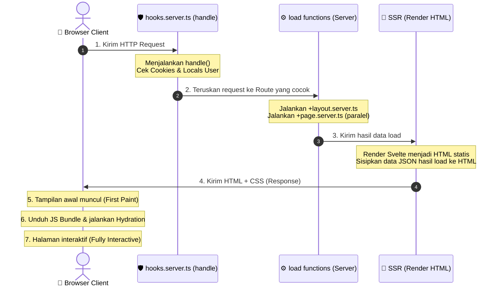

# SvelteKit Request-to-Render Lifecycle

Dokumen ini menjelaskan siklus hidup (lifecycle) dari sebuah request yang masuk ke server SvelteKit hingga halaman ditampilkan di browser pengguna.

## 1. Sequence Diagram

---

## 2. Penjelasan Tahapan

### A. Sisi Server (Server-Side)

1.  **Request Masuk & Hooks (`hooks.server.ts`)**
    *   Browser mengirim HTTP request ke server SvelteKit (misalnya saat mengakses rute `/dashboard`).
    *   SvelteKit memanggil fungsi `handle` di `hooks.server.ts`. Ini adalah middleware global untuk mengelola cookies, mengisi data session ke `event.locals.user`, atau melakukan redirect keamanan sebelum request diproses lebih lanjut.

2.  **Pencocokan Rute & Fungsi `load`**
    *   Setelah melewati middleware, SvelteKit mencocokkan rute URL dengan struktur folder (misal `src/routes/(shared)/dashboard`).
    *   SvelteKit mengeksekusi semua fungsi `load` di `+layout.server.ts` dan `+page.server.ts` secara paralel untuk mengambil data yang dibutuhkan oleh halaman.

3.  **Server-Side Rendering (SSR)**
    *   SvelteKit menggunakan data hasil fungsi `load` untuk merender berkas Svelte (`+layout.svelte` dan `+page.svelte`) menjadi HTML statis dan CSS di memori server.
    *   Data load juga diserialisasikan ke dalam tag `<script type="application/json">` di dalam HTML agar browser tidak perlu melakukan pemanggilan API tambahan untuk data yang sama.

4.  **Mengirim Response**
    *   Server mengirimkan HTML utuh beserta CSS dan referensi JavaScript bundle ke browser client.

---

### B. Sisi Browser (Client-Side)

5.  **First Paint (Tampilan Awal Cepat)**
    *   Browser menerima HTML & CSS mentah lalu langsung menampilkan strukturnya di layar.
    *   Pengguna dapat langsung melihat layout dashboard dengan sangat cepat, meskipun pada tahap awal ini halaman belum interaktif (belum bisa diklik).

6.  **Hydration (Proses Hidrasi)**
    *   Browser mengunduh berkas JavaScript aplikasi Svelte.
    *   Svelte mencocokkan HTML statis dengan logika komponen, memasang event listener (seperti tombol click), dan mengaktifkan sistem reaktivitas (Svelte Runes).

7.  **Fully Interactive (Siap Digunakan)**
    *   Aplikasi Svelte sekarang berjalan sepenuhnya secara dinamis dan interaktif di browser.
